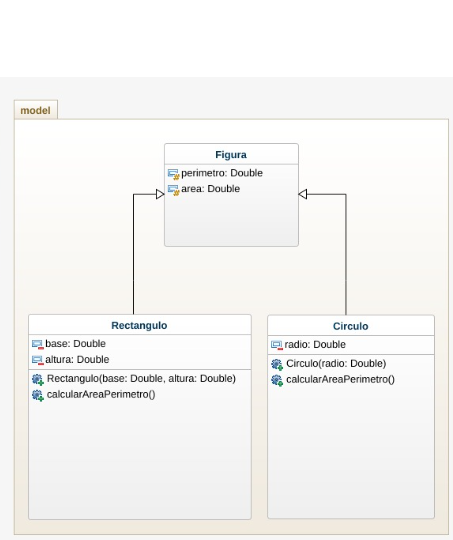

# Area Perimetro Herencia

- Area y perimetro de un rectangulo y un circulo utilizando herencia

con base  en el siguiente diagrama de clase y utilizacion de la  herencia, 
implementar un programa en Java para calcular el area y el perimetro de un rectangulo y un circulo.

## diagrama 

